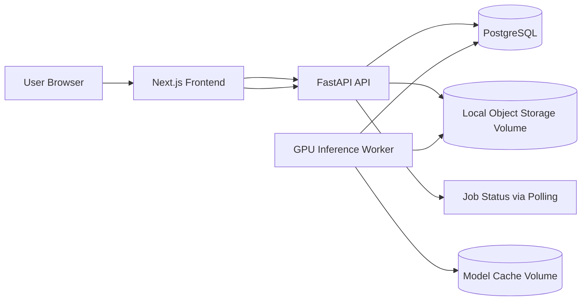
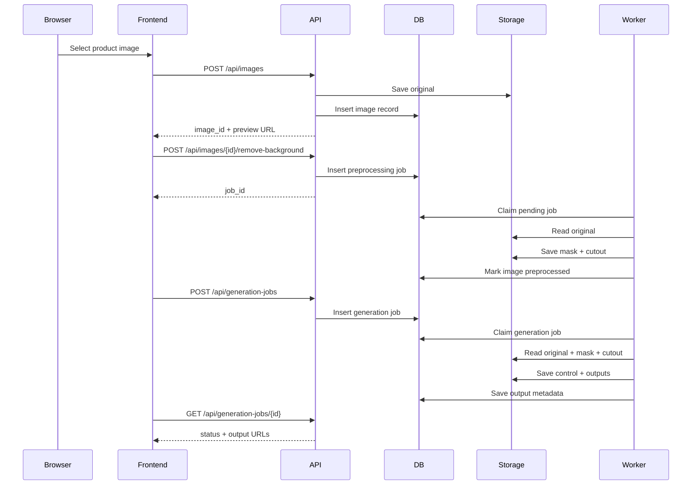
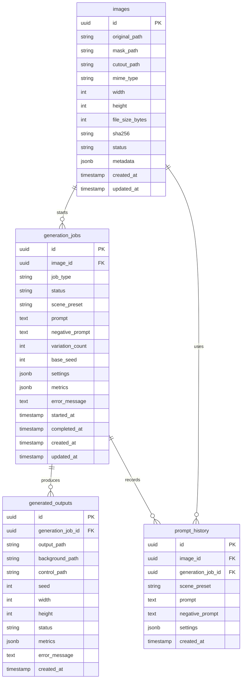
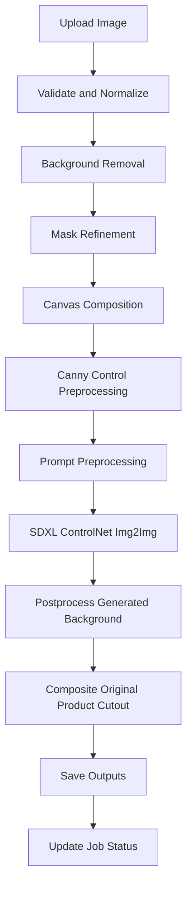
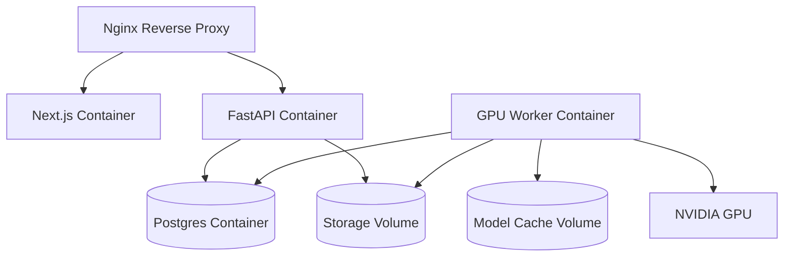
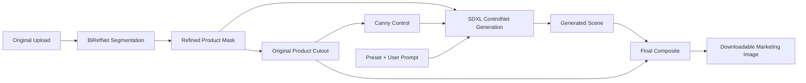

# AI Product Photography Studio Implementation Roadmap

## Executive Summary

### Project Vision

AI Product Photography Studio is a polished single-user web application that transforms ordinary smartphone product photos into professional marketing images. A user uploads a product image, removes the background, selects or writes a scene prompt, generates 3-4 studio-quality variations, compares before and after images, downloads outputs, and revisits generation history.

The product is intentionally scoped as a high-quality MVP, not a startup-scale SaaS platform. The architecture should demonstrate strong ML systems judgment, clean full-stack engineering, and production-minded design while remaining feasible for one developer to implement in roughly one month.

### Target Users

- Solo sellers listing products on Amazon, Etsy, Shopify, or social media.
- Designers and marketers creating quick product mockups.
- Students and engineers demonstrating practical generative AI product engineering.

### Problem Statement

Small sellers often lack professional product photography, studio lighting, clean backgrounds, and scene staging. Generic image generators can produce attractive images but frequently distort the product, alter labels, or lose brand-critical details. The core engineering problem is to improve the background and marketing context while preserving the uploaded product as faithfully as possible.

### Resume Value

This project is designed to signal production-oriented ML engineering:

- End-to-end generative AI application with image upload, preprocessing, background removal, ControlNet conditioning, image-to-image generation, async jobs, database persistence, storage, and deployment.
- Concrete diffusion pipeline tradeoffs rather than wrapper-only API usage.
- Clean separation between frontend, API, inference worker, ML services, persistence, and storage.
- Measurable engineering constraints: GPU memory, queueing, deterministic seeds, model caching, validation, observability, and graceful failure handling.

### Technical Highlights

- Next.js responsive frontend with before/after comparison, prompt controls, generation progress, and history.
- FastAPI backend with typed request/response schemas and automatic OpenAPI documentation.
- PostgreSQL metadata store for images, generation jobs, generated outputs, and prompt history.
- Local filesystem object storage abstraction for uploaded, processed, and generated images.
- Stable Diffusion XL image-to-image pipeline with Canny ControlNet via Hugging Face Diffusers.
- BiRefNet for high-quality product/background segmentation.
- One ControlNet model: Canny ControlNet for deterministic product outline preservation.
- Single-GPU deployment with Docker Compose, NVIDIA Container Toolkit, and one serialized inference worker.

### MVP Scope

In scope:

- Upload one product image per job.
- Automatic background removal.
- Prompted marketing background generation using presets and custom text.
- Image-to-image generation that preserves product identity.
- One ControlNet integration.
- 3-4 generated variations per job.
- Before/after comparison.
- Download outputs.
- Generation history.
- Responsive modern UI.
- Local single-machine deployment.

Out of scope:

- Editing tools beyond background removal and generation.
- Additional conditioning/model families beyond SDXL image-to-image with one Canny ControlNet.
- Multi-user, commercial, or distributed deployment capabilities.

## Functional Requirements

### 1. Upload Product Image

**Purpose:** Let users provide the source product photo used by all downstream processing.

**User flow:**

1. User opens the studio page.
2. User drags an image onto the upload area or selects a file.
3. UI previews the original image.
4. Frontend uploads the image to the backend.
5. Backend validates, stores, and records metadata.

**Inputs:**

- File: `jpg`, `jpeg`, `png`, or `webp`.
- Maximum file size: 15 MB.
- Minimum resolution: 512x512.
- Maximum decoded resolution: 4096x4096.

**Outputs:**

- `image_id`.
- Original image URL.
- Image metadata: width, height, MIME type, file size.

**Validation:**

- Reject unsupported MIME types.
- Reject oversized files.
- Decode image server-side to verify it is not a renamed invalid file.
- Normalize EXIF orientation.
- Strip unsafe metadata.

**Edge cases:**

- Corrupt image upload.
- Very large image with small compressed size.
- Transparent PNG.
- Product touching image boundaries.
- Multiple products in one photo.

**Acceptance criteria:**

- Valid image appears in the UI within 5 seconds after upload on a local machine.
- Invalid files show actionable errors.
- Backend stores original image immutably.
- Image metadata is persisted in PostgreSQL.

### 2. Automatic Background Removal

**Purpose:** Segment the product foreground to preserve product identity while generating or replacing only the background.

**User flow:**

1. User uploads an image.
2. Backend creates a background removal job or performs it during preprocessing.
3. UI displays the cutout preview on a neutral checker/solid background.
4. User can continue to generation once cutout is available.

**Inputs:**

- Original product image.
- Optional preprocessing settings: target size, padding ratio.

**Outputs:**

- Alpha-mask PNG.
- Foreground cutout PNG.
- Bounding box around detected foreground.
- Mask quality metadata: foreground coverage ratio, edge confidence heuristic.

**Validation:**

- Ensure mask dimensions match normalized source image.
- Reject masks with foreground coverage below 2% or above 95% unless user confirms.
- Ensure alpha channel is present in cutout.

**Edge cases:**

- Transparent/reflective products.
- White products on white backgrounds.
- Shadows interpreted as foreground.
- Product labels or handles with holes.
- Multiple foreground objects.

**Acceptance criteria:**

- Product cutout is generated for valid images.
- The app stores original, mask, and cutout separately.
- Failures preserve original upload and show a retry option.

### 3. AI-Generated Marketing Backgrounds

**Purpose:** Generate commercial-looking product scenes from presets or user prompts.

**User flow:**

1. User selects a preset or enters a custom scene prompt.
2. UI shows editable prompt text and generation controls.
3. User starts generation.
4. Backend creates a generation job.
5. Worker generates 3-4 variations.

**Inputs:**

- `image_id`.
- `scene_preset`: one of `white_amazon`, `luxury_studio`, `wooden_table`, `coffee_shop`, `office_desk`, `marble_surface`, `outdoor_lifestyle`.
- `prompt`: optional custom text.
- `negative_prompt`: optional text.
- `variation_count`: 3 or 4.
- `seed`: optional integer.
- Inference settings: strength, guidance scale, steps, ControlNet scale.

**Outputs:**

- Generation job ID.
- Generated image URLs.
- Prompt and settings used.
- Seeds for reproducibility.

**Validation:**

- Prompt length: 3-500 characters.
- Negative prompt length: 0-500 characters.
- Variation count: 3-4.
- Steps bounded to 20-40 for MVP.
- Strength bounded to 0.35-0.95. The production default is 0.90 because the
  product-free seed plate and final original-cutout composite protect product pixels
  while giving SDXL enough denoising freedom to follow the requested scene.

**Edge cases:**

- Prompt requests impossible composition.
- Scene conflicts with product geometry.
- White Amazon background should avoid decorative props.
- Product occupies nearly full image, leaving little background area.

**Acceptance criteria:**

- Every preset maps to a production-ready prompt template.
- Generated images retain product foreground without obvious shape drift.
- User can download each output.

### 4. Image-to-Image Generation That Preserves Product

**Purpose:** Use the uploaded image as conditioning while generating a more professional scene.

**User flow:**

1. User uploads product image and chooses a scene.
2. Backend preprocesses image into source canvas, foreground mask, control image, and generation canvas.
3. Worker runs the SDXL image-to-image pipeline with Canny ControlNet.
4. Worker composites the original product cutout over the generated scene to preserve details.

**Inputs:**

- Normalized source image.
- Product mask.
- Product cutout.
- Scene prompt.
- Canny control image.
- Generation settings.

**Outputs:**

- Generated background.
- Final composited marketing image.
- Optional diagnostic preview assets.

**Validation:**

- Mask and image sizes must match.
- Product bounding box must fit target canvas after padding.
- All generated outputs must match target aspect ratio.

**Edge cases:**

- Product has transparent regions.
- Product contains text/logo that diffusion might corrupt.
- Unwanted original background remains around edges.
- Generated background lighting conflicts with product lighting.

**Acceptance criteria:**

- Final output uses the original product cutout as the top composited layer.
- Diffusion is allowed to modify the generated background, not product identity-critical pixels.
- Output dimensions are consistent across all variations.

### 5. ControlNet Integration

**Purpose:** Add spatial conditioning to keep product shape, placement, and silhouette stable.

**Decision:** Use Canny ControlNet for the MVP.

**Why Canny is preferred over Depth for this project:**

- Canny edges are deterministic, fast, CPU-friendly, and require only OpenCV preprocessing.
- Product photography preservation benefits from hard silhouette and contour guidance.
- Depth maps from smartphone product photos can be unreliable for small, reflective, transparent, or flat products.
- Depth ControlNet adds another ML model for depth estimation, increasing memory use, latency, failure modes, and implementation time.
- The final product-preservation strategy composites the original cutout over generated backgrounds, so precise geometry and silhouette matter more than estimated scene depth.
- Canny has simpler debugging: the developer can inspect the exact control image and tune thresholds.

**Depth ControlNet advantages considered:**

- Better for preserving 3D layout, table planes, perspective, and object/background spatial relationships.
- More natural when generating complete lifestyle scenes.

**Why Depth is excluded from MVP:**

- The MVP goal is reliable product preservation on a single GPU, not perfect full-scene reconstruction.
- Depth estimation is another source of quality variance and dependency complexity.
- It is better introduced later as an optional advanced control mode.

**Pipeline consequence:**

- Generate Canny control from the foreground cutout alpha boundary and optionally from softened product luminance edges.
- Apply ControlNet only to preserve product placement and silhouette during generation.
- Use mask-based compositing to restore exact original product pixels after diffusion.

**Acceptance criteria:**

- Canny control image is saved for every generation job.
- ControlNet scale is configurable in bounded backend settings.
- Pipeline can run with ControlNet enabled by default and disabled through internal config for debugging.

### 6. Generate 3-4 Image Variations

**Purpose:** Give users enough choice while keeping GPU usage manageable.

**User flow:**

1. User chooses 3 or 4 variations.
2. Worker runs sequential seeds within a single job.
3. UI updates as each variation completes.

**Inputs:**

- `variation_count`.
- Base seed or auto-generated seed.

**Outputs:**

- 3-4 generated output records.
- One URL per output.
- Seed per output.

**Validation:**

- Reject variation counts outside 3-4.

**Edge cases:**

- One variation fails while others succeed.
- GPU out-of-memory mid-job.
- User refreshes page during generation.

**Acceptance criteria:**

- Job can partially succeed and record per-output status.
- UI shows completed images without waiting for all variations if polling sees partial completion.

### 7. Before / After Comparison

**Purpose:** Let users inspect improvement and product preservation.

**User flow:**

1. User selects a generated output.
2. UI displays original and generated image with slider comparison.
3. User can toggle original, cutout, and final output views.

**Inputs:**

- Original image URL.
- Generated output URL.

**Outputs:**

- Interactive comparison UI.

**Validation:**

- Both images must be available.
- UI should handle different aspect ratios through consistent fit mode.

**Edge cases:**

- Original image portrait, generated output square.
- Broken output URL.

**Acceptance criteria:**

- Slider works on mouse, touch, and keyboard.
- No layout shift while images load.

### 8. Download Generated Images

**Purpose:** Let users save final outputs locally.

**User flow:**

1. User clicks download on any generated output.
2. Browser downloads a PNG or JPEG.

**Inputs:**

- Generated output ID.

**Outputs:**

- File download with stable filename.

**Validation:**

- Output must exist and be completed.

**Edge cases:**

- File missing from disk but metadata exists.
- User tries to download failed job output.

**Acceptance criteria:**

- Download response includes correct content type and filename.
- Missing files return a clear error.

### 9. Generation History

**Purpose:** Preserve user work across refreshes and demonstrate persistence.

**User flow:**

1. User opens history panel.
2. UI fetches recent jobs.
3. User selects a previous job.
4. UI restores original image, prompt, settings, and outputs.

**Inputs:**

- Pagination parameters.
- Optional status filter.

**Outputs:**

- List of recent jobs and outputs.

**Validation:**

- Limit bounded to 1-50.
- Cursor or page validated.

**Edge cases:**

- Jobs with deleted files.
- Jobs with partial success.
- Database has outputs but missing prompts.

**Acceptance criteria:**

- History survives server restart.
- Failed jobs are visible with error status.
- User can reopen completed outputs.

### 10. Responsive Modern UI

**Purpose:** Provide a polished product experience suitable for interviews and demos.

**User flow:**

1. User can complete upload, generation, comparison, history, and download on desktop or mobile.

**Inputs:**

- Browser viewport and user interactions.

**Outputs:**

- Responsive studio interface.

**Validation:**

- Support current Chrome, Edge, Safari, and Firefox.
- Avoid text overflow and overlapping controls.

**Edge cases:**

- Mobile viewport with long prompt.
- Slow local inference.
- Error state while job is running.

**Acceptance criteria:**

- Desktop and mobile layouts are tested with screenshots.
- Primary workflow is available without horizontal scrolling.

## System Architecture

### Architecture Overview

The MVP uses a monorepo with a Next.js frontend, FastAPI API service, single GPU inference worker, PostgreSQL database, and local object storage volume. The API accepts uploads and job requests. The worker polls pending jobs from PostgreSQL, performs ML inference, writes output files to storage, and updates job records.



### Frontend

Responsibilities:

- Studio workspace UI.
- Upload and image preview.
- Preset and prompt controls.
- Job progress polling.
- Gallery of variations.
- Before/after comparison.
- History panel.
- Download actions.

Recommended stack:

- Next.js App Router.
- TypeScript.
- Tailwind CSS.
- React Query or TanStack Query for server state.
- Zustand for local studio state if needed.

### Backend

Responsibilities:

- Validate uploads and requests.
- Store image metadata.
- Write files through storage service.
- Create background removal and generation jobs.
- Expose job status and history APIs.
- Serve or sign local file URLs.
- Provide health and readiness endpoints.

Recommended stack:

- FastAPI.
- Pydantic schemas.
- SQLAlchemy 2.x.
- Alembic migrations.
- Pillow/OpenCV for non-ML image validation and preprocessing.

### ML Inference Layer

Responsibilities:

- Load and cache models once per worker process.
- Run background removal.
- Generate Canny control images.
- Run SDXL ControlNet image-to-image/background generation.
- Composite product cutout over generated backgrounds.
- Save outputs and diagnostics.
- Record model versions and settings.

The worker must serialize GPU jobs for the MVP. This avoids out-of-memory errors and is appropriate for a single-developer, single-GPU project.

### Diffusion Pipeline

Recommended model stack:

- Base model: Stable Diffusion XL base model through Diffusers.
- Control model: SDXL Canny ControlNet.
- Scheduler: DPM++ 2M Karras or Euler Ancestral, selected through Diffusers configuration.
- Precision: FP16 on CUDA.
- Optional memory optimizations: attention slicing, xFormers or PyTorch scaled-dot-product attention, VAE tiling.

### Image Processing Pipeline

1. Decode and normalize uploaded image.
2. Apply EXIF orientation.
3. Resize to target working canvas.
4. Remove background with BiRefNet.
5. Refine mask with morphology and feathering.
6. Create product cutout.
7. Place product on target canvas with padding.
8. Generate Canny control image.
9. Run diffusion generation.
10. Composite original product cutout onto generated scene.
11. Save final outputs and metadata.

### Database

PostgreSQL stores:

- Uploaded image metadata.
- Processing artifacts.
- Generation job status and settings.
- Generated output records.
- Prompt history.

Image files are not stored as byte arrays in PostgreSQL. The database stores paths, dimensions, hashes, and metadata only.

### Storage

MVP storage is local filesystem storage behind an internal `StorageService` abstraction:

- `storage/originals`
- `storage/masks`
- `storage/cutouts`
- `storage/control`
- `storage/outputs`
- `storage/diagnostics`

This keeps deployment simple and avoids external storage services in the MVP.

### Request Flow



## Technology Decisions

### Stable Diffusion XL vs FLUX

**Selected:** Stable Diffusion XL.

**Why selected:**

- SDXL has mature Diffusers pipelines for image-to-image generation and ControlNet.
- SDXL ControlNet checkpoints are widely available and fit the MVP's one-month timeline.
- SDXL runs acceptably on a single consumer GPU with FP16 and memory optimizations.
- It is easier to reason about in interviews because the ecosystem is established.

**Alternatives considered:**

- FLUX.1 Schnell/Dev with Flux ControlNet.

**Advantages of FLUX:**

- Strong prompt adherence and modern visual quality.
- Active ecosystem and high-quality outputs.

**Disadvantages of FLUX for this MVP:**

- Heavier inference footprint.
- ControlNet image-to-image workflows are less straightforward than SDXL for a one-month build.
- More likely to require aggressive quantization or larger GPUs.

**Tradeoff:**

SDXL is less visually state-of-the-art than the best FLUX workflows, but it is a better engineering choice for a robust, explainable, one-developer MVP.

### FastAPI

**Selected:** FastAPI.

**Why selected:**

- Strong Python typing and Pydantic validation.
- Natural fit for ML services.
- Automatic OpenAPI docs for interview demos and frontend integration.
- Supports async I/O while allowing blocking ML operations to be isolated in a worker.

**Alternatives considered:**

- Flask: simpler, but less schema-first and less ergonomic for typed APIs.
- Django: strong batteries-included framework, but heavier than needed for a single-user ML app.
- Node.js backend: good frontend alignment, weaker fit for Python-native ML inference.

**Tradeoff:**

FastAPI keeps the ML ecosystem close but requires disciplined boundaries so HTTP handlers do not become inference scripts.

### Next.js

**Selected:** Next.js App Router with TypeScript.

**Why selected:**

- Strong React ecosystem.
- File-system routing and modern frontend patterns.
- Good fit for a polished interactive studio UI.
- Easy deployment as a separate frontend container.

**Alternatives considered:**

- Vite SPA: simpler and fast, but less structured for a production-style app.
- Streamlit or Gradio: quick for demos, but weaker for demonstrating product-grade frontend engineering.

**Tradeoff:**

Next.js requires more frontend structure than a demo framework, but it creates a stronger portfolio artifact.

### PostgreSQL

**Selected:** PostgreSQL.

**Why selected:**

- Reliable relational modeling for jobs, outputs, and prompts.
- B-tree indexes for job status and history queries.
- JSONB fields for model settings and metrics where schema flexibility is useful.
- Familiar production database for interviews.

**Alternatives considered:**

- SQLite: simpler, but weaker concurrent access and less production signal.
- MongoDB: flexible, but unnecessary for strongly relational job metadata.

**Tradeoff:**

PostgreSQL adds setup complexity but improves correctness and interview value.

### Docker

**Selected:** Docker Compose with separate `frontend`, `api`, `worker`, `db`, and `reverse-proxy` services.

**Why selected:**

- Reproducible local deployment.
- Clean GPU boundary for the worker container.
- Volumes for storage and model cache.
- Realistic single-machine production deployment.

**Alternatives considered:**

- Bare-metal Python/Node processes: simpler initially, less reproducible.
- Kubernetes: overkill for the MVP and single-GPU target.

**Tradeoff:**

Docker requires careful CUDA/PyTorch compatibility, but it gives the project production shape.

### Background Removal Model

**Selected:** BiRefNet through Transformers or its official model implementation.

**Why selected:**

- High-quality dichotomous image segmentation is well aligned with product cutout needs.
- Better portfolio signal than legacy U2Net-only background removal.
- Can produce high-resolution foreground masks suitable for product photography.

**Alternatives considered:**

- rembg/U2Net: very easy to integrate, broad community use, but older quality baseline.
- Segment Anything: powerful general segmentation, but requires prompts or extra selection logic.
- Commercial APIs: high quality, but less ML engineering value and external dependency.

**Tradeoff:**

BiRefNet is heavier than rembg and may require more careful packaging. The fallback plan is to support `rembg` as a development-only adapter if BiRefNet setup blocks progress, while keeping BiRefNet as the production target.

### ControlNet Model Selection

**Selected:** SDXL Canny ControlNet.

**Why selected:**

- Canny preprocessing is deterministic and inspectable.
- Edge conditioning preserves product silhouette and placement.
- Lower engineering risk than Depth ControlNet.
- Does not require a separate depth-estimation model.
- Works well with final compositing, where original product pixels are restored.

**Alternatives considered:**

- SDXL Depth ControlNet.

**Tradeoff:**

Canny may over-constrain hard edges and can create outline artifacts if the control scale is too high. This is mitigated with mask-derived edges, moderate `controlnet_conditioning_scale`, and final cutout compositing.

### Job Queue Strategy

**Selected:** PostgreSQL-backed queue table with one worker using `SELECT FOR UPDATE SKIP LOCKED`.

**Why selected:**

- Avoids adding Redis/Celery for a single-GPU MVP.
- Keeps queue state durable and queryable.
- Demonstrates concurrency control without infrastructure sprawl.

**Alternatives considered:**

- Celery + Redis: production-proven, but more moving parts.
- In-process background tasks: simpler, but fragile across restarts.

**Tradeoff:**

The Postgres queue is not designed for high throughput, but it is reliable and appropriate for one GPU.

## Repository Structure

```text
ai-product-photo-studio/
  README.md
  implementation_roadmap.md
  docker-compose.yml
  .env.example
  .gitignore

  frontend/
    package.json
    next.config.ts
    tsconfig.json
    tailwind.config.ts
    src/
      app/
        page.tsx
        layout.tsx
        globals.css
      components/
        studio/
        image-upload/
        prompt-panel/
        generation-grid/
        before-after/
        history/
        common/
      lib/
        api-client.ts
        types.ts
        constants.ts
      hooks/
      stores/
      tests/

  backend/
    pyproject.toml
    alembic.ini
    app/
      main.py
      core/
        config.py
        logging.py
        errors.py
      api/
        routes/
          health.py
          images.py
          generation_jobs.py
          history.py
          downloads.py
        dependencies.py
      schemas/
        images.py
        jobs.py
        outputs.py
        prompts.py
        errors.py
      db/
        session.py
        models.py
        repositories/
        migrations/
      services/
        storage_service.py
        image_service.py
        job_service.py
        prompt_service.py
      tests/

  worker/
    pyproject.toml
    app/
      main.py
      config.py
      job_runner.py
      pipelines/
        background_removal.py
        canny_control.py
        sdxl_generation.py
        postprocessing.py
      models/
        model_registry.py
        model_versions.py
      services/
        storage_client.py
        db_client.py
      tests/

  shared/
    python/
      image_contracts.py
      job_states.py
      storage_paths.py

  infra/
    nginx/
      nginx.conf
    scripts/
      download_models.sh
      wait_for_db.sh
      smoke_test.sh

  storage/
    originals/
    masks/
    cutouts/
    control/
    outputs/
    diagnostics/

  model_cache/
```

### Directory Explanation

- `frontend`: Product UI and browser-side workflow.
- `backend`: HTTP API, validation, persistence, and storage orchestration.
- `worker`: Long-running GPU worker and ML pipeline code.
- `shared`: Small cross-service constants/contracts. Keep minimal to avoid accidental coupling.
- `infra`: Deployment support files.
- `storage`: Local object storage volume for generated artifacts.
- `model_cache`: Persistent Hugging Face/PyTorch model cache.

## Database Design

### Entity Relationship Diagram



### Tables

#### `images`

Stores uploaded source images and preprocessing artifacts.

Fields:

- `id`: UUID primary key.
- `original_path`: storage path for immutable upload.
- `mask_path`: storage path for alpha mask.
- `cutout_path`: storage path for foreground cutout.
- `mime_type`, `width`, `height`, `file_size_bytes`, `sha256`.
- `status`: `uploaded`, `processing`, `ready`, `failed`.
- `metadata`: JSONB for EXIF-normalization notes, foreground bbox, mask metrics.
- `created_at`, `updated_at`.

Indexes:

- B-tree on `created_at DESC`.
- B-tree on `status`.
- Unique index on `sha256` optional for deduplication.

#### `generation_jobs`

Stores generation job metadata.

Fields:

- `id`: UUID primary key.
- `image_id`: foreign key to `images`.
- `job_type`: `background_generation` for MVP, retained as an enum for future extensibility.
- `status`: `pending`, `running`, `succeeded`, `partially_succeeded`, `failed`, `cancelled`.
- `scene_preset`.
- `prompt`, `negative_prompt`.
- `variation_count`, `base_seed`.
- `settings`: JSONB for strength, guidance, steps, control scale, canvas size.
- `metrics`: JSONB for latency, GPU memory if captured, preprocessing durations.
- `error_message`.
- timestamps.

Indexes:

- Composite B-tree on `(status, created_at)` for worker polling.
- B-tree on `(image_id, created_at DESC)` for history.
- GIN index on `settings` only if settings search is implemented.

#### `generated_outputs`

Stores one row per generated variation.

Fields:

- `id`: UUID primary key.
- `generation_job_id`: foreign key.
- `output_path`: final composited image.
- `background_path`: optional raw generated background.
- `control_path`: Canny control diagnostic.
- `seed`.
- `width`, `height`.
- `status`: `pending`, `running`, `succeeded`, `failed`.
- `metrics`: JSONB.
- `error_message`.
- `created_at`.

Indexes:

- B-tree on `generation_job_id`.
- B-tree on `created_at DESC`.

#### `prompt_history`

Stores prompt usage for reuse and auditability.

Fields:

- `id`: UUID primary key.
- `image_id`: foreign key.
- `generation_job_id`: nullable foreign key.
- `scene_preset`.
- `prompt`, `negative_prompt`.
- `settings`: JSONB snapshot.
- `created_at`.

Indexes:

- B-tree on `created_at DESC`.
- B-tree on `scene_preset`.

### Relationship Rules

- An image can have many jobs.
- A generation job belongs to one image.
- A generation job produces many outputs.
- Prompt history references the image and usually the generation job.
- Deleting source images should be a future feature; MVP should avoid destructive deletes.

## API Design

All routes are prefixed with `/api`. Responses use JSON except file downloads and image content.

### Standard Error Shape

```json
{
  "error": {
    "code": "VALIDATION_ERROR",
    "message": "Prompt must be between 3 and 500 characters.",
    "details": {}
  }
}
```

### `GET /api/health`

**Purpose:** Basic API health check.

**Response:**

```json
{
  "status": "ok",
  "version": "0.1.0"
}
```

**Error handling:** Return `503` if database is unavailable for readiness endpoint variant.

### `POST /api/images`

**Purpose:** Upload original product image.

**Request:** `multipart/form-data`

- `file`: required image file.

**Response `201`:**

```json
{
  "image_id": "uuid",
  "status": "uploaded",
  "original_url": "/api/images/uuid/original",
  "width": 1536,
  "height": 2048,
  "mime_type": "image/jpeg"
}
```

**Validation:**

- MIME type allowlist.
- File size <= 15 MB.
- Decoded dimensions within range.

**Errors:**

- `400 INVALID_IMAGE`.
- `413 FILE_TOO_LARGE`.
- `415 UNSUPPORTED_MEDIA_TYPE`.

### `GET /api/images/{image_id}`

**Purpose:** Fetch image metadata and preprocessing status.

**Response `200`:**

```json
{
  "image_id": "uuid",
  "status": "ready",
  "original_url": "/api/images/uuid/original",
  "mask_url": "/api/images/uuid/mask",
  "cutout_url": "/api/images/uuid/cutout",
  "metadata": {
    "foreground_bbox": [120, 80, 900, 1300],
    "foreground_coverage": 0.42
  }
}
```

**Errors:** `404 IMAGE_NOT_FOUND`.

### `GET /api/images/{image_id}/original`

**Purpose:** Stream original image.

**Response:** Image bytes.

**Errors:** `404 IMAGE_NOT_FOUND`, `404 FILE_NOT_FOUND`.

### `GET /api/images/{image_id}/mask`

**Purpose:** Stream alpha mask PNG.

**Response:** PNG bytes.

**Errors:** `409 IMAGE_NOT_READY`, `404 FILE_NOT_FOUND`.

### `GET /api/images/{image_id}/cutout`

**Purpose:** Stream product cutout PNG.

**Response:** PNG bytes.

**Errors:** `409 IMAGE_NOT_READY`, `404 FILE_NOT_FOUND`.

### `POST /api/images/{image_id}/remove-background`

**Purpose:** Create a preprocessing job.

**Request:**

```json
{
  "force": false
}
```

**Response `202`:**

```json
{
  "job_id": "uuid",
  "image_id": "uuid",
  "status": "pending"
}
```

**Validation:**

- Image must exist.
- If image is already ready and `force=false`, return current status.

**Errors:**

- `404 IMAGE_NOT_FOUND`.
- `409 IMAGE_ALREADY_PROCESSING`.

### `POST /api/generation-jobs`

**Purpose:** Start background generation.

**Request:**

```json
{
  "image_id": "uuid",
  "scene_preset": "luxury_studio",
  "prompt": "premium skincare bottle on a dark stone surface with soft studio lighting",
  "negative_prompt": "distorted label, extra product, watermark, blurry",
  "variation_count": 4,
  "seed": 12345,
  "settings": {
    "steps": 30,
    "guidance_scale": 7.0,
    "strength": 0.55,
    "controlnet_conditioning_scale": 0.65,
    "canvas_size": 1024
  }
}
```

**Response `202`:**

```json
{
  "job_id": "uuid",
  "status": "pending"
}
```

**Validation:**

- Image exists and is `ready`.
- Preset is valid.
- Variation count is 3 or 4.
- Settings are within bounded ranges.

**Errors:**

- `404 IMAGE_NOT_FOUND`.
- `409 IMAGE_NOT_READY`.
- `422 INVALID_GENERATION_SETTINGS`.

### `GET /api/generation-jobs/{job_id}`

**Purpose:** Poll job status and outputs.

**Response `200`:**

```json
{
  "job_id": "uuid",
  "image_id": "uuid",
  "status": "succeeded",
  "progress": {
    "completed_outputs": 4,
    "total_outputs": 4
  },
  "outputs": [
    {
      "output_id": "uuid",
      "status": "succeeded",
      "url": "/api/outputs/uuid/image",
      "download_url": "/api/outputs/uuid/download",
      "seed": 12345
    }
  ],
  "error_message": null
}
```

**Errors:** `404 JOB_NOT_FOUND`.

### `GET /api/generation-jobs`

**Purpose:** List generation history.

**Query params:**

- `limit`: default 20, max 50.
- `cursor`: optional timestamp/ID cursor.
- `status`: optional filter.

**Response `200`:**

```json
{
  "items": [
    {
      "job_id": "uuid",
      "image_id": "uuid",
      "status": "succeeded",
      "scene_preset": "coffee_shop",
      "created_at": "2026-07-20T12:00:00Z",
      "thumbnail_url": "/api/outputs/uuid/image"
    }
  ],
  "next_cursor": null
}
```

**Errors:** `422 INVALID_PAGINATION`.

### `GET /api/outputs/{output_id}/image`

**Purpose:** Stream generated output.

**Response:** Image bytes.

**Errors:** `404 OUTPUT_NOT_FOUND`, `404 FILE_NOT_FOUND`, `409 OUTPUT_NOT_READY`.

### `GET /api/outputs/{output_id}/download`

**Purpose:** Download generated output.

**Response:** Image bytes with `Content-Disposition`.

**Errors:** same as image route.

### `GET /api/prompts/history`

**Purpose:** Fetch recent prompts for reuse.

**Query params:**

- `limit`: default 20, max 50.

**Response `200`:**

```json
{
  "items": [
    {
      "id": "uuid",
      "scene_preset": "marble_surface",
      "prompt": "minimal cosmetic bottle on white marble with soft daylight",
      "negative_prompt": "warped logo, extra objects",
      "created_at": "2026-07-20T12:00:00Z"
    }
  ]
}
```

## ML Pipeline

### End-to-End Pipeline



### Stage 1: Image Upload

- Decode with Pillow.
- Normalize EXIF orientation.
- Convert to RGB for model input.
- Preserve transparent input alpha separately if present.
- Compute SHA-256 hash.
- Store immutable original.

### Stage 2: Background Removal

- Load BiRefNet once in worker startup.
- Resize image to model-compatible input while preserving aspect ratio.
- Run segmentation to produce foreground probability mask.
- Convert probability map to alpha mask.
- Store raw mask for diagnostics.

### Stage 3: Mask Refinement

- Apply thresholding to create binary mask.
- Use morphological close/open to fill small holes and remove specks.
- Feather edges with a small Gaussian blur.
- Estimate foreground bounding box.
- Reject or warn on suspicious foreground coverage.

### Stage 4: Prompt Preprocessing

Preset prompts should combine user intent with product-preservation constraints.

Base positive suffix:

```text
professional product photography, realistic lighting, commercial marketing image, sharp focus, clean composition
```

Base negative prompt:

```text
distorted product, changed logo, unreadable label, duplicate product, extra object, deformed shape, watermark, low resolution, blurry, noisy
```

Preset examples:

- `white_amazon`: `product centered on pure white seamless background, even softbox lighting, clean commercial catalog style`
- `luxury_studio`: `premium product on elegant studio surface, dramatic soft lighting, refined highlights, upscale editorial style`
- `wooden_table`: `product on natural wooden table, warm daylight, realistic tabletop texture, soft background blur`
- `coffee_shop`: `product on cafe table, warm ambient coffee shop background, shallow depth of field`
- `office_desk`: `product on modern office desk, clean workspace, soft daylight, professional lifestyle setting`
- `marble_surface`: `product on white marble surface, bright premium beauty product photography, soft shadows`
- `outdoor_lifestyle`: `product in outdoor lifestyle setting, natural daylight, tasteful background bokeh`

### Stage 5: Image Preprocessing

- Target canvas: 1024x1024 for MVP.
- Place product using bounding box with 8-15% padding.
- Keep aspect ratio stable.
- Generate transparent cutout and neutral init image.
- Build generation mask where background is editable and product region is protected.

### Stage 6: ControlNet Preprocessing

- Generate Canny edges using OpenCV.
- Recommended start thresholds: 80 and 160.
- Prefer mask-aware Canny:
  - Use product cutout luminance inside foreground mask.
  - Include alpha boundary edges.
  - Suppress original background edges.
- Save `control_path` for each job.

### Stage 7: Stable Diffusion Inference

Primary path:

- Use SDXL ControlNet pipeline with Canny conditioning for scene generation.
- Use image-to-image behavior with Canny conditioning and a background-editing mask.
- Protect product area with mask.
- Generate one variation per seed sequentially.
- Default settings:
  - `steps`: 25.
  - `guidance_scale`: 8.0.
  - `strength`: 0.90.
  - `controlnet_conditioning_scale`: 0.30.
  - `width`: 512 on the validated 8 GB demo GPU.
  - `height`: 512 on the validated 8 GB demo GPU.

Generation strategy:

- Start with the validated 0.90 strength for product-free scene plates.
- Reduce strength only when a preset's deterministic scene prior should dominate.
- Keep ControlNet scale moderate to avoid hard outline artifacts.
- Save raw background before final compositing.

### Stage 8: Post-Processing

- Composite original cutout over generated scene.
- Feather mask edge by 1-3 pixels.
- Convert to sRGB.
- Save PNG for transparency-preserving assets or JPEG/PNG for final marketing images.
- Generate thumbnails for history.

### Stage 9: Output Generation

For each variation, persist:

- Final output image.
- Optional raw generated background.
- Canny control image.
- Seed and settings.
- Latency metrics.
- Error status if failed.

### ML Failure Handling

- Catch CUDA out-of-memory, clear cache, mark job failed with actionable message.
- If one variation fails, continue remaining variations when safe.
- If background removal fails, do not start generation.
- Record model names and versions in job settings.

## Project Milestones

### Week 1: Foundation and Core App Skeleton

**Objectives:**

- Establish monorepo, Docker, frontend shell, FastAPI API, PostgreSQL schema, storage abstraction, and upload flow.

**Deliverables:**

- Running frontend and backend.
- Database migrations.
- Image upload and metadata persistence.
- Local storage service.
- Basic studio layout.

**Dependencies:**

- Node.js, Python, Docker, PostgreSQL.

**Expected outcome:**

- User can upload an image, see a preview, and retrieve image metadata from the API.

### Week 2: Background Removal and Preprocessing

**Objectives:**

- Implement worker, Postgres-backed queue, BiRefNet background removal, mask refinement, and cutout preview.

**Deliverables:**

- Worker service.
- Background removal job flow.
- Mask/cutout storage.
- Cutout UI preview.
- Tests for image validation and job transitions.

**Dependencies:**

- Week 1 upload and storage.
- GPU/PyTorch environment.

**Expected outcome:**

- User can upload a product photo and receive a clean cutout.

### Week 3: Diffusion Generation and ControlNet

**Objectives:**

- Implement Canny preprocessing, SDXL ControlNet generation, output compositing, variation generation, and progress polling.

**Deliverables:**

- Model registry.
- Canny control artifacts.
- Generation jobs.
- 3-4 output variations.
- Before/after comparison.
- Download route.

**Dependencies:**

- Week 2 cutout pipeline.
- Downloaded SDXL and ControlNet model weights.

**Expected outcome:**

- User can generate and download professional product marketing images.

### Week 4: History, Polish, Deployment

**Objectives:**

- Add generation history, responsive polish, monitoring, and deployment documentation.

**Deliverables:**

- Generation history.
- Docker Compose GPU deployment.
- Smoke tests and demo script.
- README usage instructions.

**Dependencies:**

- Week 3 generation pipeline.

**Expected outcome:**

- The app is a polished MVP ready for portfolio demo and interview discussion.

## Detailed Implementation Roadmap

### Phase 1: Project Foundation

**Task 001: Initialize repository metadata**

- Description: Create README, `.gitignore`, `.env.example`, and top-level documentation pointers.
- Expected files: `README.md`, `.gitignore`, `.env.example`.
- Dependencies: None.
- Completion criteria: Repository explains local setup goals and environment variables.

**Task 002: Create Docker Compose skeleton**

- Description: Define services for frontend, API, worker, database, reverse proxy, storage volume, and model cache volume.
- Expected files: `docker-compose.yml`, `infra/nginx/nginx.conf`.
- Dependencies: Task 001.
- Completion criteria: Compose config validates and database service starts.

**Task 003: Scaffold backend project**

- Description: Create FastAPI project with app factory, config, logging, and health route.
- Expected files: `backend/pyproject.toml`, `backend/app/main.py`, `backend/app/core/*`, `backend/app/api/routes/health.py`.
- Dependencies: Task 001.
- Completion criteria: `GET /api/health` returns healthy response locally.

**Task 004: Scaffold frontend project**

- Description: Create Next.js TypeScript app with Tailwind and base layout.
- Expected files: `frontend/package.json`, `frontend/src/app/*`, `frontend/src/components/*`.
- Dependencies: Task 001.
- Completion criteria: Frontend renders studio shell.

**Task 005: Configure database connectivity**

- Description: Add SQLAlchemy session management and database settings.
- Expected files: `backend/app/db/session.py`, `backend/app/core/config.py`.
- Dependencies: Task 003.
- Completion criteria: API can connect to PostgreSQL.

**Task 006: Add Alembic migrations**

- Description: Configure Alembic and create initial migration.
- Expected files: `backend/alembic.ini`, `backend/app/db/migrations/*`.
- Dependencies: Task 005.
- Completion criteria: Migrations run from empty database.

**Task 007: Define database models**

- Description: Implement ORM models for images, jobs, outputs, and prompt history.
- Expected files: `backend/app/db/models.py`.
- Dependencies: Task 006.
- Completion criteria: Tables match database design.

**Task 008: Define shared job states**

- Description: Create enums/constants for image statuses, job statuses, and job types.
- Expected files: `shared/python/job_states.py`.
- Dependencies: Task 007.
- Completion criteria: Backend and worker can import consistent state names.

**Task 009: Implement backend repositories**

- Description: Add data-access classes for images, jobs, outputs, and prompts.
- Expected files: `backend/app/db/repositories/*`.
- Dependencies: Task 007.
- Completion criteria: Repository unit tests can create and fetch records.

**Task 010: Add API error handling**

- Description: Implement standard error shape and exception handlers.
- Expected files: `backend/app/core/errors.py`, `backend/app/schemas/errors.py`.
- Dependencies: Task 003.
- Completion criteria: Validation and not-found errors use consistent JSON format.

### Phase 2: Upload, Storage, and Frontend Workflow

**Task 011: Implement storage path contracts**

- Description: Define deterministic path construction for originals, masks, cutouts, control images, and outputs.
- Expected files: `shared/python/storage_paths.py`.
- Dependencies: Task 008.
- Completion criteria: Paths are collision-resistant and organized by UUID.

**Task 012: Implement storage service**

- Description: Add local filesystem storage abstraction with save, open, exists, URL mapping, and content type helpers.
- Expected files: `backend/app/services/storage_service.py`.
- Dependencies: Task 011.
- Completion criteria: Service can store and stream files from configured root.

**Task 013: Add image validation service**

- Description: Decode images, validate MIME/dimensions/size, normalize EXIF, compute hash.
- Expected files: `backend/app/services/image_service.py`.
- Dependencies: Task 012.
- Completion criteria: Invalid images are rejected and valid images return metadata.

**Task 014: Create upload schemas**

- Description: Define image response schemas.
- Expected files: `backend/app/schemas/images.py`.
- Dependencies: Task 013.
- Completion criteria: OpenAPI displays image schemas.

**Task 015: Implement image upload endpoint**

- Description: Add `POST /api/images`.
- Expected files: `backend/app/api/routes/images.py`.
- Dependencies: Tasks 009, 013, 014.
- Completion criteria: Upload stores file and database row.

**Task 016: Implement image metadata endpoint**

- Description: Add `GET /api/images/{image_id}`.
- Expected files: `backend/app/api/routes/images.py`.
- Dependencies: Task 015.
- Completion criteria: UI can fetch upload metadata.

**Task 017: Implement image streaming endpoints**

- Description: Add routes for original, mask, and cutout image streaming.
- Expected files: `backend/app/api/routes/images.py`.
- Dependencies: Task 012.
- Completion criteria: Browser can render stored images by URL.

**Task 018: Create frontend API client**

- Description: Add typed client functions for upload and image retrieval.
- Expected files: `frontend/src/lib/api-client.ts`, `frontend/src/lib/types.ts`.
- Dependencies: Tasks 015-017.
- Completion criteria: Frontend can call API with typed responses.

**Task 019: Build upload component**

- Description: Implement drag/drop and file picker with preview.
- Expected files: `frontend/src/components/image-upload/*`.
- Dependencies: Task 018.
- Completion criteria: User can upload valid image and see original preview.

**Task 020: Build studio state container**

- Description: Track active image, prompt, selected preset, active job, and selected output.
- Expected files: `frontend/src/stores/*` or `frontend/src/hooks/*`.
- Dependencies: Task 019.
- Completion criteria: Upload state survives component navigation within page.

**Task 021: Add frontend error states**

- Description: Display validation failures and upload errors.
- Expected files: `frontend/src/components/common/*`, upload component files.
- Dependencies: Task 019.
- Completion criteria: Unsupported files show clear UI errors.

### Phase 3: Worker and Background Removal

**Task 022: Scaffold worker project**

- Description: Create worker entrypoint, config, logging, and dependency setup.
- Expected files: `worker/pyproject.toml`, `worker/app/main.py`, `worker/app/config.py`.
- Dependencies: Task 002.
- Completion criteria: Worker starts and connects to database.

**Task 023: Implement Postgres job claiming**

- Description: Claim pending jobs using row locks and status transitions.
- Expected files: `worker/app/services/db_client.py`, `worker/app/job_runner.py`.
- Dependencies: Tasks 007, 022.
- Completion criteria: One worker claims each pending job once.

**Task 024: Implement backend job service**

- Description: Encapsulate job creation, status fetching, and state transitions.
- Expected files: `backend/app/services/job_service.py`.
- Dependencies: Task 009.
- Completion criteria: API can create durable pending jobs.

**Task 025: Add background removal endpoint**

- Description: Add `POST /api/images/{image_id}/remove-background`.
- Expected files: `backend/app/api/routes/images.py`.
- Dependencies: Task 024.
- Completion criteria: Endpoint creates preprocessing job.

**Task 026: Implement worker storage client**

- Description: Read and write files using same storage path contracts as backend.
- Expected files: `worker/app/services/storage_client.py`.
- Dependencies: Tasks 011, 022.
- Completion criteria: Worker can read uploaded originals and write artifacts.

**Task 027: Implement model registry**

- Description: Centralize model loading, device placement, precision, and version reporting.
- Expected files: `worker/app/models/model_registry.py`, `worker/app/models/model_versions.py`.
- Dependencies: Task 022.
- Completion criteria: Models are loaded lazily and reused.

**Task 028: Implement BiRefNet adapter**

- Description: Load BiRefNet and expose a `predict_mask(image)` interface.
- Expected files: `worker/app/pipelines/background_removal.py`.
- Dependencies: Task 027.
- Completion criteria: Adapter returns mask with same dimensions as input image.

**Task 029: Implement mask refinement**

- Description: Add thresholding, morphology, feathering, coverage metrics, and bounding box calculation.
- Expected files: `worker/app/pipelines/background_removal.py`, `worker/app/pipelines/postprocessing.py`.
- Dependencies: Task 028.
- Completion criteria: Refined masks are stable and saved as PNG.

**Task 030: Implement cutout generation**

- Description: Apply alpha mask to original image and save transparent PNG.
- Expected files: `worker/app/pipelines/background_removal.py`.
- Dependencies: Task 029.
- Completion criteria: Cutout contains alpha channel and preserved product pixels.

**Task 031: Wire background removal job execution**

- Description: Worker handles preprocessing jobs end to end.
- Expected files: `worker/app/job_runner.py`.
- Dependencies: Tasks 023, 026, 030.
- Completion criteria: Job transitions from pending to succeeded and image becomes ready.

**Task 032: Build cutout preview UI**

- Description: Display original and cutout once preprocessing completes.
- Expected files: `frontend/src/components/studio/*`, `frontend/src/components/image-upload/*`.
- Dependencies: Tasks 025, 031.
- Completion criteria: User sees cutout preview after background removal.

**Task 033: Add polling for preprocessing**

- Description: Poll image metadata until status changes to ready or failed.
- Expected files: `frontend/src/hooks/*`.
- Dependencies: Task 032.
- Completion criteria: UI updates without manual refresh.

**Task 034: Add preprocessing tests**

- Description: Test upload validation, job creation, status transitions, and mask utility behavior.
- Expected files: `backend/app/tests/*`, `worker/app/tests/*`.
- Dependencies: Tasks 025, 031.
- Completion criteria: Tests cover success and failure paths.

### Phase 4: Generation Pipeline

**Task 035: Define generation schemas**

- Description: Add request and response schemas for generation jobs.
- Expected files: `backend/app/schemas/jobs.py`, `backend/app/schemas/outputs.py`.
- Dependencies: Task 024.
- Completion criteria: OpenAPI documents generation contract.

**Task 036: Implement generation job endpoint**

- Description: Add `POST /api/generation-jobs`.
- Expected files: `backend/app/api/routes/generation_jobs.py`.
- Dependencies: Tasks 024, 035.
- Completion criteria: Valid requests create pending generation jobs.

**Task 037: Implement job status endpoint**

- Description: Add `GET /api/generation-jobs/{job_id}`.
- Expected files: `backend/app/api/routes/generation_jobs.py`.
- Dependencies: Task 036.
- Completion criteria: UI can poll progress and outputs.

**Task 038: Implement output streaming and download endpoints**

- Description: Add `/api/outputs/{output_id}/image` and `/download`.
- Expected files: `backend/app/api/routes/downloads.py`.
- Dependencies: Task 012.
- Completion criteria: Completed outputs can be viewed and downloaded.

**Task 039: Build prompt presets**

- Description: Define preset labels, templates, and default settings.
- Expected files: `frontend/src/lib/constants.ts`, backend prompt config if duplicated server-side.
- Dependencies: Task 036.
- Completion criteria: UI and backend share valid preset list.

**Task 040: Build prompt panel UI**

- Description: Add preset selector, prompt input, negative prompt input, variation count, and advanced settings.
- Expected files: `frontend/src/components/prompt-panel/*`.
- Dependencies: Tasks 018, 039.
- Completion criteria: User can configure generation request.

**Task 041: Implement prompt validation**

- Description: Validate prompt lengths, preset enum, variation count, and bounded inference settings.
- Expected files: `backend/app/schemas/jobs.py`.
- Dependencies: Task 036.
- Completion criteria: Invalid settings return structured errors.

**Task 042: Implement Canny control preprocessing**

- Description: Generate mask-aware Canny control image from cutout and alpha boundary.
- Expected files: `worker/app/pipelines/canny_control.py`.
- Dependencies: Task 031.
- Completion criteria: Control image is saved and visually inspectable.

**Task 043: Implement canvas composition**

- Description: Resize and center product cutout on 1024 canvas with padding and mask.
- Expected files: `worker/app/pipelines/postprocessing.py`.
- Dependencies: Task 030.
- Completion criteria: Canvas, product mask, and bbox are deterministic.

**Task 044: Implement SDXL model loading**

- Description: Load SDXL base, VAE, scheduler, and Canny ControlNet in FP16.
- Expected files: `worker/app/pipelines/sdxl_generation.py`, `worker/app/models/model_registry.py`.
- Dependencies: Task 027.
- Completion criteria: Worker loads model stack once without OOM on target GPU.

**Task 045: Implement single-variation generation**

- Description: Generate one scene from prompt, image, mask, Canny control, seed, and settings.
- Expected files: `worker/app/pipelines/sdxl_generation.py`.
- Dependencies: Tasks 042-044.
- Completion criteria: One final image can be generated from a ready image.

**Task 046: Implement final compositing**

- Description: Composite original product cutout over generated background with a lightly feathered edge.
- Expected files: `worker/app/pipelines/postprocessing.py`.
- Dependencies: Task 045.
- Completion criteria: Product details match source cutout.

**Task 047: Implement multi-variation loop**

- Description: Generate 3-4 outputs sequentially and store per-output rows.
- Expected files: `worker/app/job_runner.py`, `worker/app/pipelines/sdxl_generation.py`.
- Dependencies: Task 046.
- Completion criteria: Job produces requested number of outputs or partial success.

**Task 048: Save generation diagnostics**

- Description: Persist control image, raw background, seeds, settings, and timing metrics.
- Expected files: `worker/app/job_runner.py`.
- Dependencies: Task 047.
- Completion criteria: Each output has traceable metadata.

**Task 049: Add generation polling UI**

- Description: Start generation and poll job status.
- Expected files: `frontend/src/hooks/*`, `frontend/src/components/studio/*`.
- Dependencies: Tasks 036, 037, 040.
- Completion criteria: UI shows pending, running, success, and failure states.

**Task 050: Build generation grid**

- Description: Display 3-4 generated outputs with status, seed, select, and download actions.
- Expected files: `frontend/src/components/generation-grid/*`.
- Dependencies: Tasks 038, 049.
- Completion criteria: User can select and download outputs.

**Task 051: Build before/after comparison**

- Description: Implement responsive slider comparing original and generated image.
- Expected files: `frontend/src/components/before-after/*`.
- Dependencies: Task 050.
- Completion criteria: Slider works on desktop and mobile.

**Task 052: Add generation tests**

- Description: Test request validation, status endpoint, output records, and pure preprocessing helpers.
- Expected files: `backend/app/tests/*`, `worker/app/tests/*`.
- Dependencies: Tasks 036-048.
- Completion criteria: Non-GPU tests pass in CI/local CPU environment.

### Phase 5: History, Polish, and Deployment

**Task 053: Implement history endpoint**

- Description: Add paginated `GET /api/generation-jobs`.
- Expected files: `backend/app/api/routes/history.py` or `generation_jobs.py`.
- Dependencies: Task 037.
- Completion criteria: Returns recent jobs with thumbnails.

**Task 054: Implement prompt history endpoint**

- Description: Add `GET /api/prompts/history`.
- Expected files: `backend/app/api/routes/history.py`, `backend/app/schemas/prompts.py`.
- Dependencies: Task 036.
- Completion criteria: Recent prompts can be retrieved.

**Task 055: Record prompt history on job creation**

- Description: Persist prompt snapshot for each generation job.
- Expected files: `backend/app/services/prompt_service.py`.
- Dependencies: Task 054.
- Completion criteria: Generation creates prompt history row.

**Task 056: Build history UI**

- Description: Add history panel with recent jobs, status chips, thumbnails, and restore action.
- Expected files: `frontend/src/components/history/*`.
- Dependencies: Tasks 053-055.
- Completion criteria: User can reopen previous jobs.

**Task 057: Add responsive layout polish**

- Description: Refine desktop/mobile layouts, image aspect ratios, loading skeletons, and empty states.
- Expected files: `frontend/src/app/globals.css`, studio components.
- Dependencies: Tasks 019, 040, 050, 056.
- Completion criteria: UI is usable at 375px, tablet, and desktop widths.

**Task 058: Add accessibility pass**

- Description: Ensure labels, keyboard controls, focus states, alt text, and button semantics.
- Expected files: frontend components.
- Dependencies: Task 057.
- Completion criteria: Primary workflow is keyboard navigable.

**Task 059: Add backend observability**

- Description: Add structured logs, request IDs, job timing metrics, and health readiness.
- Expected files: `backend/app/core/logging.py`, `worker/app/*`.
- Dependencies: Tasks 003, 022.
- Completion criteria: Logs can trace a job from API request to worker completion.

**Task 060: Add GPU failure handling**

- Description: Catch CUDA OOM and model-load failures with cleanup and durable job errors.
- Expected files: `worker/app/job_runner.py`, pipeline files.
- Dependencies: Tasks 044-047.
- Completion criteria: OOM does not crash-loop indefinitely without clear status.

**Task 061: Add deployment environment configuration**

- Description: Complete `.env.example` with API, DB, storage, CUDA, model, and frontend variables.
- Expected files: `.env.example`, backend/worker config.
- Dependencies: Task 002.
- Completion criteria: Fresh developer can configure local deployment.

**Task 062: Finalize Docker GPU configuration**

- Description: Configure worker service GPU reservation and model cache volume.
- Expected files: `docker-compose.yml`.
- Dependencies: Task 044.
- Completion criteria: Worker can access NVIDIA GPU in container.

**Task 063: Add smoke test script**

- Description: Create script that checks API health, DB migration, upload route, and worker status.
- Expected files: `infra/scripts/smoke_test.sh`.
- Dependencies: Tasks 015, 031, 036.
- Completion criteria: Script verifies core services are reachable.

**Task 064: Add README demo guide**

- Description: Document setup, model downloads, running services, and demo workflow.
- Expected files: `README.md`.
- Dependencies: Tasks 061-063.
- Completion criteria: A reviewer can run the app from README instructions.

**Task 065: Final QA and interview packaging**

- Description: Run full local workflow, capture screenshots, record known limitations, and polish talking points.
- Expected files: `README.md`, optional `docs/demo.md`.
- Dependencies: All previous tasks.
- Completion criteria: Project is demo-ready and limitations are explicit.

## Deployment

### Single-GPU Deployment Target

Target environment:

- One Linux machine.
- NVIDIA GPU with 12 GB VRAM minimum; 16-24 GB preferred.
- NVIDIA driver installed on host.
- Docker and Docker Compose.
- NVIDIA Container Toolkit.

### Docker Architecture



Services:

- `frontend`: Next.js app.
- `api`: FastAPI app.
- `worker`: GPU-enabled ML worker.
- `db`: PostgreSQL.
- `nginx`: reverse proxy.

### Environment Variables

Core:

- `APP_ENV=local|production`
- `API_BASE_URL`
- `FRONTEND_ORIGIN`
- `DATABASE_URL`
- `STORAGE_ROOT`
- `PUBLIC_STORAGE_BASE_URL`

Worker:

- `DEVICE=cuda`
- `TORCH_DTYPE=float16`
- `MODEL_CACHE_DIR=/models`
- `SDXL_BASE_MODEL`
- `SDXL_CANNY_CONTROLNET_MODEL`
- `BACKGROUND_REMOVAL_MODEL=ZhengPeng7/BiRefNet`
- `MAX_CONCURRENT_GPU_JOBS=1`
- `DEFAULT_CANVAS_SIZE=1024`

Operational:

- `LOG_LEVEL`
- `JOB_POLL_INTERVAL_SECONDS`
- `JOB_TIMEOUT_SECONDS`
- `MAX_UPLOAD_MB`

### GPU Inference

- Only the worker container receives GPU access.
- Compose should reserve one GPU for worker.
- Use persistent model cache to avoid repeated downloads.
- Warm model registry on worker startup only if startup latency is acceptable; otherwise lazy-load on first job.
- Serialize jobs to avoid VRAM fragmentation and OOM.

### Storage

- Use Docker volume mounted at `/app/storage`.
- Store files by category and UUID.
- Never overwrite original uploads.
- Add periodic cleanup as a future maintenance feature, not MVP behavior.

### Reverse Proxy

Nginx routes:

- `/` to frontend.
- `/api/*` to FastAPI.
- Optional static file acceleration can be added later, but MVP should stream through API for validation and consistent errors.

### Monitoring

MVP observability:

- Structured JSON logs.
- Request ID propagated from API to worker job metadata.
- Job duration metrics in database.
- Health endpoints:
  - API liveness.
  - API readiness with DB check.
  - Worker heartbeat row or log.

Future monitoring:

- Prometheus metrics.
- GPU utilization exporter.
- Error dashboard.

## Risks

### Technical Risks

**Risk:** CUDA/PyTorch/Diffusers version mismatch.

- Mitigation: Pin versions, use official CUDA base image, document tested driver/CUDA combination.

**Risk:** Worker and API diverge on storage paths or job states.

- Mitigation: Keep small shared contracts and integration tests.

**Risk:** Large uploads cause memory pressure.

- Mitigation: Enforce file size and decoded resolution limits before full processing.

### ML Risks

**Risk:** Product identity changes during diffusion.

- Mitigation: Protect product with mask, use Canny conditioning, composite original cutout after generation, and tune strength lower for product-heavy images.

**Risk:** Background removal quality varies by product type.

- Mitigation: Store mask diagnostics, add mask refinement, expose retry, and document failure cases.

**Risk:** Canny creates visible outlines.

- Mitigation: Use moderate ControlNet scale, mask-aware control images, and final compositing with feathered edges.

### Performance Bottlenecks

**Bottleneck:** SDXL generation latency.

- Mitigation: 1024 canvas, 30 steps default, FP16, one worker, model caching, optional attention optimizations.

**Bottleneck:** Model loading time.

- Mitigation: Persistent cache and lazy singleton model registry.

**Bottleneck:** Sequential variations.

- Mitigation: Show partial progress and persist each output as it completes.

### GPU Limitations

**Risk:** 8-12 GB VRAM may be tight for SDXL + ControlNet.

- Mitigation: Use CPU offload only if necessary, VAE tiling, attention slicing, lower batch size to 1, serialize outputs, reduce canvas size to 768 as emergency fallback.

**Risk:** GPU OOM leaves process unstable.

- Mitigation: Catch OOM, clear cache, mark job failed, and consider process restart policy.

### Single-Machine Scope Considerations

The MVP intentionally optimizes for one GPU and one user/demo workload. The roadmap does not include distributed queues or multi-worker orchestration. If the local demo workload grows, the first improvements should stay single-machine:

- Keep the single worker but add stricter job timeouts.
- Add disk cleanup for old artifacts.
- Add better queue visibility in the UI.
- Reduce default canvas size or step count on smaller GPUs.

Distributed deployment, autoscaling, and multi-GPU routing are deliberately excluded from this roadmap.

## Future Extensions

### Preset Library Expansion

Add more curated scene presets after the core pipeline is stable. This preserves the same SDXL + Canny architecture while improving product usefulness through better prompt templates.

### Quality Evaluation Dashboard

Add offline evaluation pages that compare prompt, seed, mask metrics, and output diagnostics. This keeps quality review explainable and avoids adding another model-driven decision layer.

### Export Format Options

Add output size and format choices such as square marketplace images, portrait social images, PNG, and JPEG. The MVP should first keep one reliable 1024x1024 output path.

### Storage Maintenance

Add retention policies, artifact cleanup, and disk-usage reporting for long-running local demos. This is operational polish, not core product functionality.

## Interview Preparation

### Resume Bullet Points

- Built an end-to-end AI product photography studio using Next.js, FastAPI, PostgreSQL, Docker, and SDXL diffusion pipelines to transform smartphone product photos into marketing images.
- Designed a single-GPU inference architecture with asynchronous PostgreSQL-backed job processing, model caching, deterministic seeds, artifact storage, and robust job state management.
- Integrated BiRefNet background removal, mask refinement, Canny ControlNet conditioning, SDXL image-to-image generation, and post-generation product compositing to preserve product identity.
- Implemented production-style API contracts, database schema, storage abstraction, generation history, before/after comparison, and downloadable image outputs.

### Key Engineering Decisions

- Chose SDXL over FLUX for mature image-to-image and ControlNet support.
- Chose Canny ControlNet over Depth ControlNet for deterministic, low-dependency silhouette preservation.
- Used original cutout compositing after diffusion to reduce product/logo corruption.
- Used PostgreSQL-backed queue instead of Redis/Celery to keep MVP infrastructure focused.
- Used local filesystem storage behind an abstraction to keep artifact handling clean and testable.
- Serialized GPU jobs to avoid VRAM contention.

### ML Concepts Demonstrated

- Image segmentation and alpha matting.
- Mask refinement and morphological operations.
- Prompt engineering and negative prompts.
- Deterministic generation with seeds.
- Model loading, caching, precision, and GPU memory management.
- Latency and failure handling in ML inference services.

### Diffusion Model Concepts Demonstrated

- Latent diffusion.
- Image-to-image denoising strength.
- Classifier-free guidance.
- Scheduler tradeoffs.
- VAE encoding/decoding.
- Artifact mitigation and post-processing.

### ControlNet Concepts Demonstrated

- Spatial conditioning with auxiliary control images.
- Canny edge maps as conditioning inputs.
- Control scale tuning.
- Tradeoffs between edge and depth conditioning.
- Why control is useful but insufficient without masking/compositing.

### System Design Highlights

- Separation of API and GPU worker.
- Durable job state and partial output persistence.
- Immutable original assets.
- Storage abstraction.
- Responsive frontend with progressive job polling.
- Single-GPU deployment and observability plan.

### Likely Interviewer Questions

- Why did you choose SDXL instead of FLUX?
- Why Canny ControlNet instead of Depth ControlNet?
- How do you prevent the model from changing the product label?
- How does the job queue work without Redis?
- Why did you keep inference to one GPU and one worker?
- What happens if generation fails halfway through 4 variations?
- How do you validate user-uploaded images safely?
- How do you handle CUDA out-of-memory errors?
- What would you improve with another month?
- How would you evaluate generated image quality?

### Strong Technical Talking Points

- The pipeline does not rely on diffusion alone for product preservation; it combines segmentation, ControlNet, masked generation, and final compositing.
- The architecture chooses reliability over novelty: SDXL is not the newest possible model, but it is the right tool for a maintainable MVP.
- The database schema records enough lineage to reproduce and debug outputs.
- The worker is intentionally serialized because the physical bottleneck is one GPU.
- The app has future migration paths without prematurely implementing SaaS complexity.

## Principal Engineer Design Review

### Initial Architecture Critique

**Weakness 1: Product preservation still depends on mask quality.**

If BiRefNet misses translucent edges, handles, holes, or shadows, final compositing can look pasted-on.

**Improvement:**

- Store raw and refined masks.
- Add conservative feathering.
- Use feathered compositing without adding separate contact-shadow synthesis.
- Keep manual cutout editing out of the roadmap so the product remains implementable in one month.

**Weakness 2: SDXL ControlNet can be VRAM-heavy.**

SDXL plus ControlNet may be difficult on lower-end GPUs.

**Improvement:**

- Batch size must always be 1.
- Generate variations sequentially.
- Support 768 fallback internally.
- Enable memory optimization settings.
- Keep FLUX out of MVP.

**Weakness 3: Postgres-backed queue is not a general distributed queue.**

It is acceptable for one worker but not ideal for high throughput.

**Improvement:**

- Make the queue interface explicit.
- Use row locks safely.
- Keep job state transitions idempotent.
- Keep Celery/Redis out of this roadmap unless the project scope changes materially.

**Weakness 4: History is single-user and globally scoped.**

For the rescoped MVP this is acceptable, but it is not privacy-safe for shared deployment.

**Improvement:**

- Explicitly document the single-user assumption.
- Keep account, payment, and tenant boundaries out of the MVP.
- Keep the data model simple enough to extend later if accounts are added.

### Revised Final Architecture

The final reviewed architecture remains a monorepo with Next.js, FastAPI, PostgreSQL, local storage, and one GPU worker. The key revision is that product preservation is defined as a layered strategy:

1. Segment product foreground with BiRefNet.
2. Refine and store mask.
3. Use mask-aware Canny ControlNet for silhouette and placement conditioning.
4. Generate background/scene with protected product region.
5. Composite original product cutout onto final output.
6. Use conservative feathered compositing to reduce pasted-on edges without adding contact-shadow synthesis.



### Final Design Principles

- Preserve product identity through deterministic image processing, not just prompt instructions.
- Keep the MVP single-user and single-GPU by design.
- Store every important artifact for debuggability.
- Prefer explicit, bounded settings over exposing every diffusion parameter.
- Make future scaling paths obvious without implementing them early.

## Reference Notes

The design aligns with current official and primary documentation for the selected technologies:

- Hugging Face Diffusers SDXL ControlNet documentation: https://huggingface.co/docs/diffusers/main/api/pipelines/controlnet_sdxl
- Hugging Face Diffusers image-to-image documentation: https://huggingface.co/docs/diffusers/api/pipelines/stable_diffusion/img2img
- Hugging Face Diffusers Flux ControlNet documentation considered for comparison: https://huggingface.co/docs/diffusers/main/api/pipelines/controlnet_flux
- FastAPI validation and OpenAPI behavior: https://fastapi.tiangolo.com/tutorial/body/ and https://fastapi.tiangolo.com/tutorial/first-steps/
- Next.js App Router documentation: https://nextjs.org/docs/app
- PostgreSQL indexing and JSONB documentation: https://www.postgresql.org/docs/current/indexes-types.html and https://www.postgresql.org/docs/17/datatype-json.html
- Docker Compose GPU reservations: https://docs.docker.com/compose/how-tos/gpu-support/
- NVIDIA Container Toolkit overview: https://docs.nvidia.com/datacenter/cloud-native/container-toolkit/latest/
- BiRefNet official repository: https://github.com/ZhengPeng7/BiRefNet
- rembg repository considered as fallback: https://github.com/danielgatis/rembg
